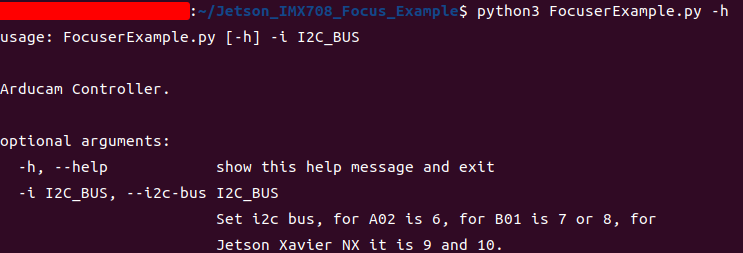
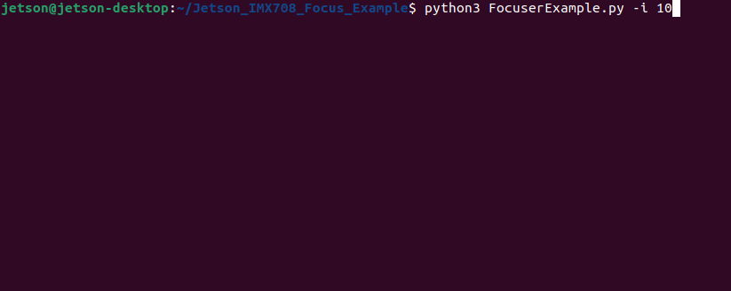
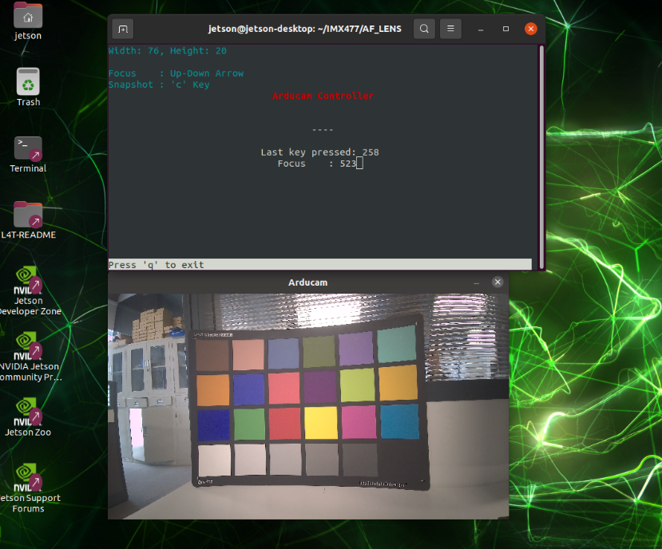

# Description
This is the example how to use ArduCam IMX708 AF Module on Jetson Orin Nano

# Usage
* FocuserExample.py Example of manual focus  
    python FocuserExample.py -i 7  

    help:  
      

    example:  
      

    Screenshot:  
      
    Tip: The I2C bus of the **CAM0** interface of **Jetson Nano B01 is 7**, and the I2C bus of the **CAM1** interface is **8**.  
    The I2C bus of the **CAM0** interface of **Jetson Xavier NX is 10**, and the I2C bus of the **CAM1** interface is **9**.
    The I2C bus of the **CAM0** interface of **Jetson Orin Nano is 9**, and the I2C bus of the **CAM1** interface is **10**.
